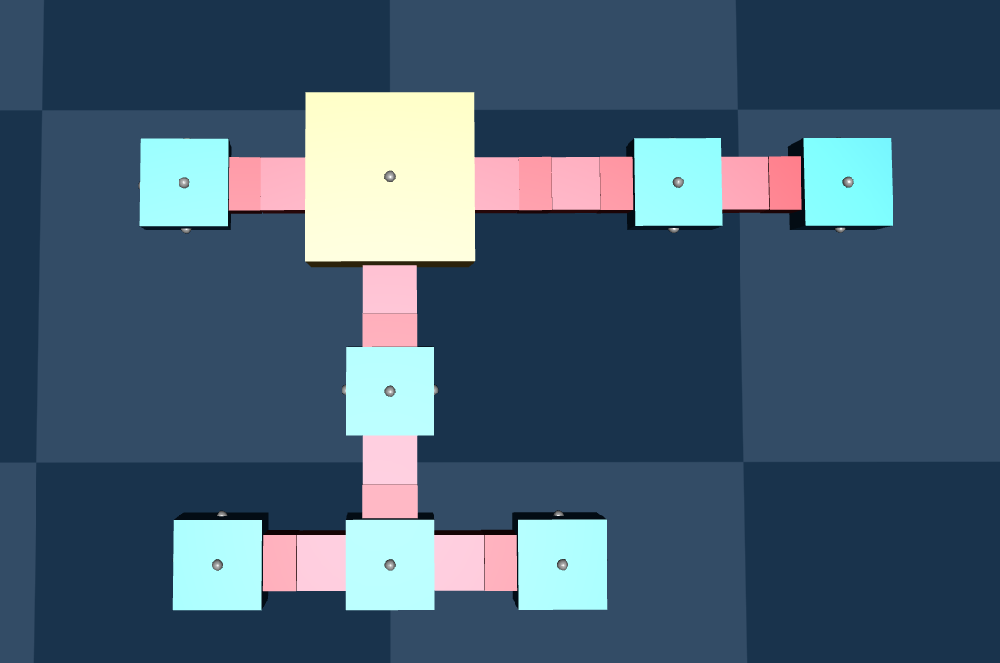
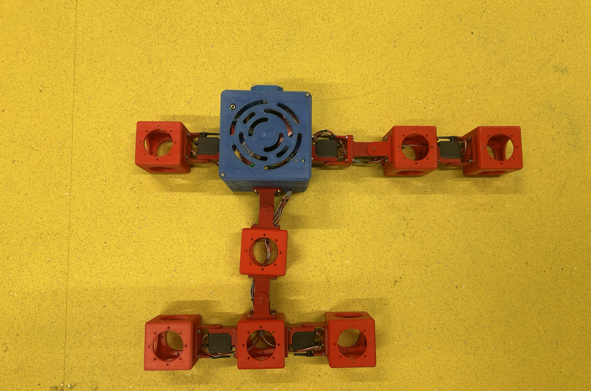

# 🤖 Baby Robot Homing

This repository contains the framework used to evolve motion controllers and execute vision-based homing tasks for **Baby Robot**—an asymmetric, modular robot.




The project uses the VU Computational Intelligence group's [ARIEL](https://github.com/ci-group/ariel/) framework for simulation and evolution, and [robohat](https://github.com/ci-group/robohat/) for physical hardware validation.


This architecture relies on the following design choice:

* **CPG Evolution with Domain-Randomization:** Choosing NaCPG as the robot's controller, applying domain randomization to help reduce sim-to-real gap.
* **HSV Target Perception:** A color-masking pipeline to navigate the robot to the charging station.
* **Behavior-Switching Layer:** A high-level state machine that switches between forward navigation and spin-corrections based on battery life and visual targets.

---

## 🛠️ Installation & Setup

This project is built using **Python 3.12** and managed via **`uv`** for reliable package management. Because ARIEL is integrated as a git submodule, make sure to clone recursively.

```bash
# Clone the repository along with its submodules
git clone --recurse-submodules <repo-url>
cd <repo-dir>
git submodule update --init --recursive

# Install dependencies and sync the environment
uv sync

```

### Running the Core Scripts

You can quickly check the configuration options for the primary simulation entry points using `uv run`:

```bash
uv run python experiments/gait_final_DR.py --help
uv run python experiments/spin_final_DR.py --help
uv run python experiments/demo_behavior_tree.py --help

```

> ⚠️ **Hardware Note:** Physical deployment requires the VU Robohat libraries, Picamera2, and access to the physical robot itself. Because these depend heavily on the Raspberry Pi/hardware environment, they are *not* installed by the base `uv sync` command. Implementation details can be found in [hardware_implementation_notes.md](wiki/hardware_implementation_notes.md).

---

## 📂 Repository Architecture

* `ariel/`: The ARIEL submodule handling modular robot bodies, simulation environments, and foundational CPG components.
* `blocks/`: Contains the structural definition of Baby Robot and a lightweight CPG runtime loader for the hardware phase (allowing deployment without pulling in heavy simulation dependencies).
* `robot_control/`: The core logic engine. Reusable modules for training loops, evaluation metrics, behavior trees, vision processing, domain randomization, and rendering.
* `experiments/`: Main simulation entry points where the magic happens (gait evolution, spin optimization, and behavior-tree demos).
* `hardware/`: Code meant to be deployed directly onto the physical robot, including reference Robohat utilities.
* `helper/`: A comprehensive suite of utilities for calibration, data visualization, model selection, and video recording.
* `pyproject.toml` & `uv.lock`: Environment and dependency configurations.

---

## 🚀 Main Execution Workflow

> 📝 **Note on Pre-trained Models:** The `--model` and `meta` arguments look for trained checkpoints in a `results/` directory. Because these raw model weights are not included in this repository, you will need to train the gaits first before running the behavior tree demos.

1. **Evolve the Forward Gait:** `experiments/gait_final_DR.py` evolves the domain-randomized forward CPG gait used for primary locomotion.
2. **Evolve the Turning Gaits:** `experiments/spin_final_DR.py` evolves the left and right spinning gaits used for searching the environment and correcting headings.
3. **Run the Simulation Demo:** `experiments/demo_behavior_tree.py` runs the full homing loop in simulation, combining the evolved gaits, simulated camera vision, battery drain, and behavior switching.
4. **Deploy to Hardware:** `hardware/run_behavior_tree_hardware.py` executes the full homing task on the physical Baby Robot, while `hardware/baby_hardware.py` maps the abstract joint commands to actual Robohat servo pulses and logs onboard sensor telemetry (IMU, battery, etc.).

---

## 🧰 The Helper Scripts

The `helper/` directory contains various scripts tailored to specific phases of the project lifecycle.

### 1. Pre-Training & Hardware Calibration

Use these before trying to evolve complex behaviors to ensure the simulation math matches physical realities:

* `record_hinge_sweep.py` & `diagnose_hinge_tracking.py`: Inspect actuator responses and check how well the robot tracks commanded vs. observed joint angles.
* `tune_hinge_actuator_gains.py`: Fine-tune simulated motor gains against real-world data traces.
* `calibrate_reach_vision_area.py`: Establish the camera bounding-box threshold that signals the robot has successfully "arrived" at the target.

### 2. Model Evaluation & Selection (Post-Training)

* `select_best_models.py`: Parses your training outputs and grabs the top-performing checkpoints.
* `visualize_robot.py` / `visualize_static_robot.py`: Opens an interactive GUI to inspect Baby Robot’s physical build and its alignment relative to the charging station.

### 3. HSV Range Adjustments

* `render_orange_hsv_range.py` (and its `_short` variant): Overlays the active HSV mask on top of the camera feed. Essential for tweaking color thresholds to ensure the charging dock is properly isolated under different lighting conditions.

### 4. Morphology Iteration

* `ab_test_hinge_forward.py` & `ab_test_hinge_spin.py`: A/B test different physical hinge sizes in simulation to see how they impact forward and spinning velocity before settling on a permanent robot build.

### 5. Data Plotting & Academic Reporting

Once your simulation and hardware trials are complete, use these to generate camera-ready plots (mostly tracking metrics out of the `results/` folder):

* **Execution Batches:** `make_all_summary_plots.py` and `make_all_diagnostic_plots.py` run the entire plotting pipeline in one go. *(Note: The directory name `diagonostic` is intentionally misspelled to preserve legacy file paths).*
* **System Diagnostics:** Track distance-to-target curves (`plot_distance_to_target.py`), vision tracking status (`plot_vision_timeseries.py`), and how battery discharge correlates with behavior states (`plot_battery_phase_sequence.py`, `plot_behavior_timeline.py`).
* **Performance Analysis:** Visualize training fitness histories over time, check champion model robustness distributions via whisker plots, and overlay real-world physical trajectories directly onto simulation predictions (`plot_gait_sim_real_trajectories.py`).
